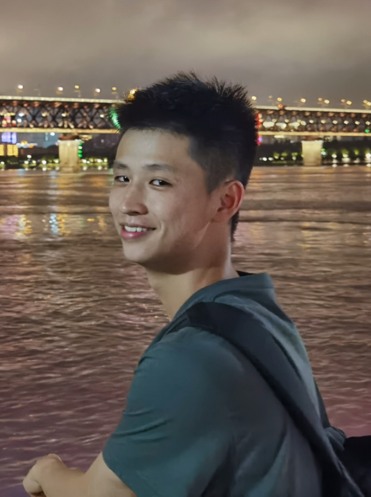

  

    

    Hi! This is my personal page. 
    

    

    I love physics, mathematics, and EECS. In terms of EECS, I am particularly interested in the embedded systems, especially, HW-SW codesign with scientic instruments (e.g., FPGA design with quantum processors, single photon detectors).
    

    

    I graduated from Wuhan University with a bachelor's degree and am currently pursuing a Ph.D. at the <a href="https://quantumlah.org">National University of Singapore - Centre for Quantum Technologies</a>.
    

  

  
  

    <!--  -->
    Haifei Wang (王海飞)
  

  

