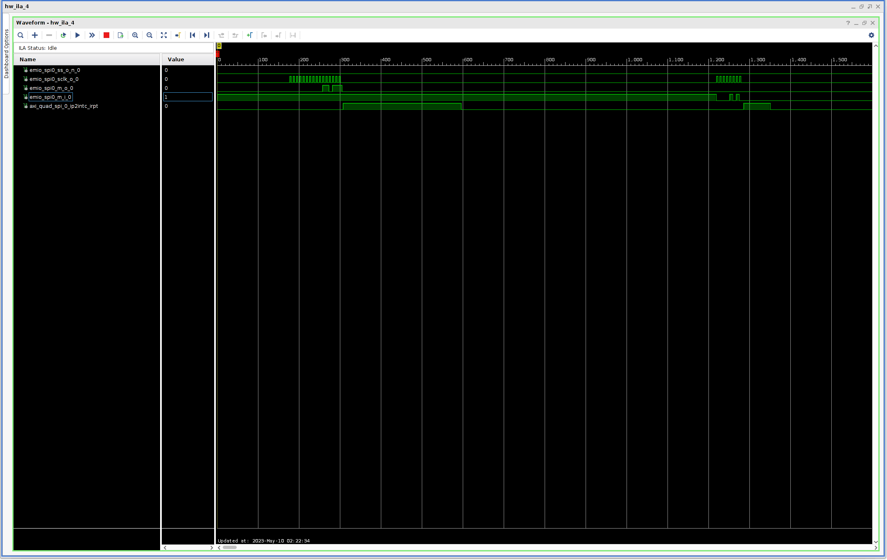
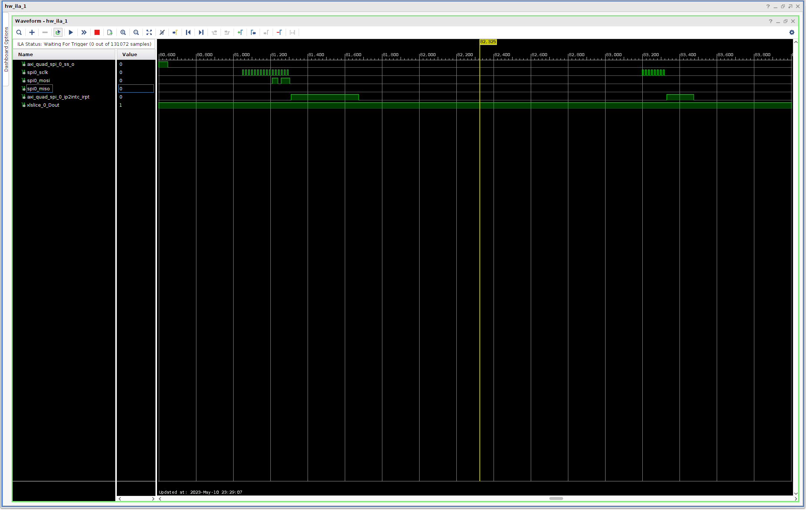
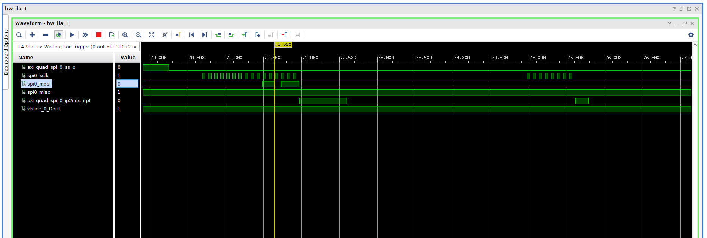

> 给从今年三月到现在断断续续的工作做一个总结

## 1  AD9361 + PYNQ 内核

### 1.1 现有工作

这个工作基本上来说就是通过 Petalinux 将 PYNQ 和 AD9361 的驱动构建到同一个内核中。

在 ZedBoard 上，[2019_R1](https://github.com/analogdevicesinc/meta-adi/tree/2019_R1) + [PYNQ v2.4](https://github.com/Xilinx/PYNQ/tree/image_v2.4) 版本可以成功。启星和我在这个[链接](https://github.com/hfwang132/zedboard-adi-pynq)中总结了构建的步骤以及各种可能的问题和解决办法。

在 PYNQ-ZU 上，由于 PYNQ-ZU 的 BSP 只有 PYNQ v2.7 及以后的版本，而 PYNQ v2.7 需要配合 2020 年版本的工具链，并且在该版本遇到了一些问题（见 1.2.1 节），因此没有成功。

### 1.2 遇到的问题

#### 1.2.1 ADI 的 Yocto Layer 与 PYNQ 不兼容

**2019 年之后的版本**的 [meta-adi](https://github.com/analogdevicesinc/meta-adi) 的 [recipes-bsp](https://github.com/analogdevicesinc/meta-adi/blob/master/meta-adi-xilinx/recipes-bsp/device-tree/device-tree.bbappend#L166) 会覆盖掉 PYNQ 的 [recipes-bsp](https://github.com/Xilinx/PYNQ/blob/master/sdbuild/boot/meta-pynq/recipes-bsp/device-tree/device-tree.bbappend) 所引入的修改。

如下是文件 `meta-adi-xilinx/recipes-bsp/device-tree/device-tree.bbappend` 的一部分：

```bb
do_configure:append() {
    ...
    cp "${KERNEL_DTB_PATH}/${KERNEL_DTB}.dts" "${DT_FILES_PATH}/system-top.dts"
    ...
}
```

它直接将 `system-top.dts` 覆盖掉。而更合适的实践应该是向 `system-top.dts` 中[增加代码](https://github.com/Xilinx/PYNQ/blob/image_v3.0.1/sdbuild/boot/meta-pynq/recipes-bsp/device-tree/device-tree.bbappend#L22)（PYNQ 就是这么做的）。

由于这个原因，没有构建出 [ADI master branch](https://github.com/analogdevicesinc/meta-adi) + PYNQ v3.0.1 的内核。也许可以对 [recipes-bsp](https://github.com/analogdevicesinc/meta-adi/blob/master/meta-adi-xilinx/recipes-bsp/device-tree/device-tree.bbappend#L166) 做一些修改从而使其与 PYNQ 兼容，但是这个工作搁置了。并且我们有理由搁置这个工作，见下一节（第 1.2.2 节）。

> 另外，Yocto 官方建议，当使用多个 Yocto Layer 的时候，应该要去 [OpenEmbedded Layer Index](https://layers.openembedded.org/layerindex/branch/master/layers/) 和 [Yocto Project Compatible Index](https://www.yoctoproject.org/software-overview/layers/) 查看不同的 Layer 之间是否兼容。不幸的是，这两个 Index 并未收录 meta-pynq 和 meta-adi。

#### 1.2.2 FPGA MANAGER 的问题

[meta-adi-xilinx 的文档](https://github.com/analogdevicesinc/meta-adi/tree/master/meta-adi-xilinx#fpga-manager)明确提到了他们**没有对 FPGA MANAGER 的官方支持**。而如果禁用 FPGA MANAGER，那么就无法在板卡启动之后重载比特流。这让 PYNQ 失去了意义。

**我猜 ADI 的想法是将 FPGA 作为一个功能固定的外设，即，设备树和比特流都在系统启动的时候加载好，并且不希望被修改。这与 PYNQ 的想法从根本上是矛盾的**。

因此，不建议将 AD9361 和 PYNQ 的驱动集成在一个内核中，而是允许系统启动后动态地加载 AD9361 的设备树和比特流，见下一节（第 2 节）。

## 2  User-Space AD9361 驱动

### 2.1 已有的工作

为了绕开上一节提到的困难，可以在用户空间中使用 AD9361 驱动，而不是将驱动集成到内核中。但是，为了与 AD9361 的 SPI 接口通信，需要在 Linux 设备树中添加一个 `spidev` 节点，从而允许通过读写 `/dev/spidevx.y` 文件来读写 SPI

> 在 `/dev/spidevx.y` 中，`x` 代表第 `x` 个 SPI 控制器，`y` 代表第 `y` 个片选。如果使用 PS SPI，那么设备名可能为 `/dev/spidev0.0`；如果使用 PL SPI（AXI SPI），则设备名可能为 `/dev/spidev1.0`。

设备树通常在启动时被 U-Boot 加载好，并且不可修改。但是 4.14 版本之后的 Linux 内核增加了对 device tree overlay（以下简称 DTO）的支持。DTO 允许在运行时动态加载新的设备树。PYNQ 库也提供了 [API](https://pynq.readthedocs.io/en/latest/pynq_package/pynq.overlay.html#pynq.overlay.Overlay) 来实现这个操作：

```python
class pynq.overlay.Overlay(bitfile_name, dtbo=None, download=True, ignore_version=False, device=None, gen_cache=False)
```

这个 API 不仅允许下载比特流（`bitfile_name`），而且允许动态增量加载新的设备树（`dtbo`）。如下是通过 AXI SPI 加入 `spidev` 的设备树代码：

```dts
/dts-v1/;
/plugin/;
/ {
    fragment@0 {
        target = <&amba>;
        overlay0: __overlay__ {                       
            axi_quad_spi_0: axi_quad_spi@80000000 {
                ...
                status = "okay";
                #address-cells = <1>;
                #size-cells = <0>;
                spidev0: spidev@0 {
                    compatible = "spidev";
                    reg = <0>;
                    spi-max-frequency = <5000000>;
                };
            };                
        };
    };
};
```

> 有几个值得注意的点：
> 
> - 需要在 `/dts-v1/;` 后面增加一行 `/plugin/;` 来表示这是一个 Device Tree Overlay 而不是普通的 Device Tree。[ADI 的 recipes-bsp](https://github.com/analogdevicesinc/meta-adi/blob/master/meta-adi-xilinx/recipes-bsp/device-tree/device-tree.bbappend#L151) 就是通过观察文件中是否包含 `/plugin/;` 来判断设备树是否是 Overlay。
> - `target` 表示修改哪一个节点。这里是 `<&amba>`，它会被扩展为符号为 `amba` 的节点的 phandle。例如，如果 `amba` 节点的 phandle 为 `70`，那么 `<&amba>` 实际上代表 `<70>`。一个 phandle 唯一标识了一个节点，往往是由编译器（dtc）分配的。
> - 往往需要增加编译选项 `-@`。该选项启用符号功能，从而允许通过符号对设备树节点进行引用。否则，只能通过 phandle 的绝对值来引用。

上述文件编译出的 DTO 配合 AXI SPI 是可以正常使用的。这就是启星他们之前的工作。但是，在将子卡从 V3 的 [FMC9361_1.0](files/files.html) 换成 [FMCOMMS2](https://wiki.analog.com/resources/eval/user-guides/ad-fmcomms2-ebz)/FMCOMMS3 之后，SPI 通信出现了一些问题，见下一节（第 2.2 节）。

### 2.2 遇到的问题

#### 2.2.1 SPI 通信问题

> - AD9361 的寄存器地址为 10 位，第 11 位代表字节数，第 12 位代表写/读
> - AD9361 的地址为 `0x037` 的寄存器中存储了 `PRODUCT_ID`。对于 AD9361 Rev 2，PRODUCT_ID  应当为 `0x0A`。
> - AD9361 的驱动在初始化 AD9361 时，会先通过 `GPIO_RESETB` 进行硬件复位（至少 1us，实际采用了 1ms），再读取 `0x037` 寄存器。

在将 V3 的 FMC9361_1.0（以下简称 V3）换成 FMCOMMS2（以下简称 S2）和 FMCOMMS3（以下简称 S3），并修改了管脚约束之后，SPI 通信出现了问题。

具体来说，在 Master（AXI SPI 控制器）向 MOSI 上发送 `0x037`（读地址为 `0x037` 的寄存器）之后，Slave（AD9361）并未在 MISO 上发送 `0x0A`（`PRODUCT_ID`）。实际情况如下：

<style>
    /* CSS to style the image preview */
    .preview-image {
      width: 200px;
      cursor: pointer;
    }
</style>
  
<script>
function openFullImage(imageUrl) {
    // Open the full image in a new tab
    window.open(imageUrl, '_blank');
}
</script>

|子卡|现象|波形|
|-|-|-|
|V3|MISO上正确返回`0x0A`||
|S2|MISO一直为低，因此读到的是`0x00`||
|S3|MISO一直为高，因此读到的是`0xFF`||

涉及的因素如下

- 管脚约束
  * 再三通过原理图确认过四线 SPI 的 MOSI、MISO、CS 和 CLK 的管脚约束
- 复位
  * 通过 ILA 确认了 `GPIO_RESETB` 被拉低了 1ms
- SPI 模式
  * 确认了 SPI 模式为 0x01（CPOL=0，CPHA=1）
- SPI 时钟
  * 已经在 Block Design 中将 AXI SPI 的时钟频率设置得很低（10ns 系统时钟的 80 倍分频）。应该可以排除时钟质量问题。
- 电平标准
  * 在 ZU 的原理图中确认了 VADJ 为 1.8V；VCCO 也为 1.8 V；符合要求。
- 驱动问题
  * 为软件问题的可能性较低，因为 S2/S3 和 V3 用的是同一个驱动。

#### 2.2.2 DTO 问题

在 ZCU102/ZCU104 上加载 DTO 无报错，但并未出现 `/dev/spidev1.0` 文件。由于 PL 工程除了管脚约束和芯片型号以外都相同，因此通过 xsa 文件生成的 `pl.dtsi` 与 ZU 的没有区别。

初步判断原因可能和 dtc 编译器有关（之前似乎遇到过类似的问题，并且是 dtc 版本导致的）。

## 3 RTL-SDR & PYNQ-Z2

### 3.1 现有工作


### 3.2 可能的改进
